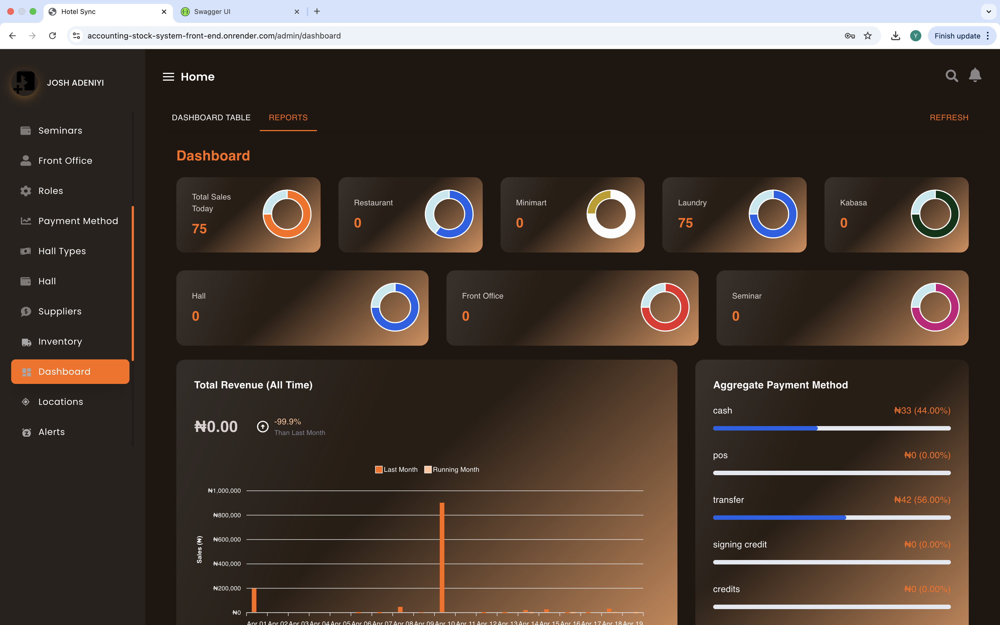
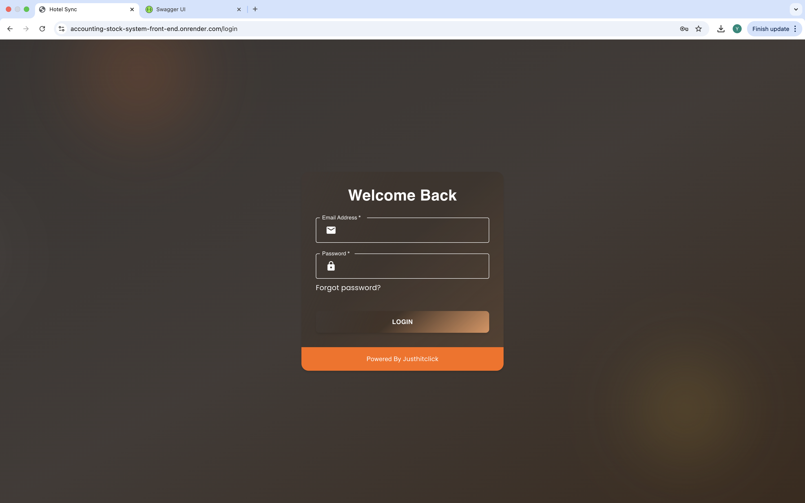
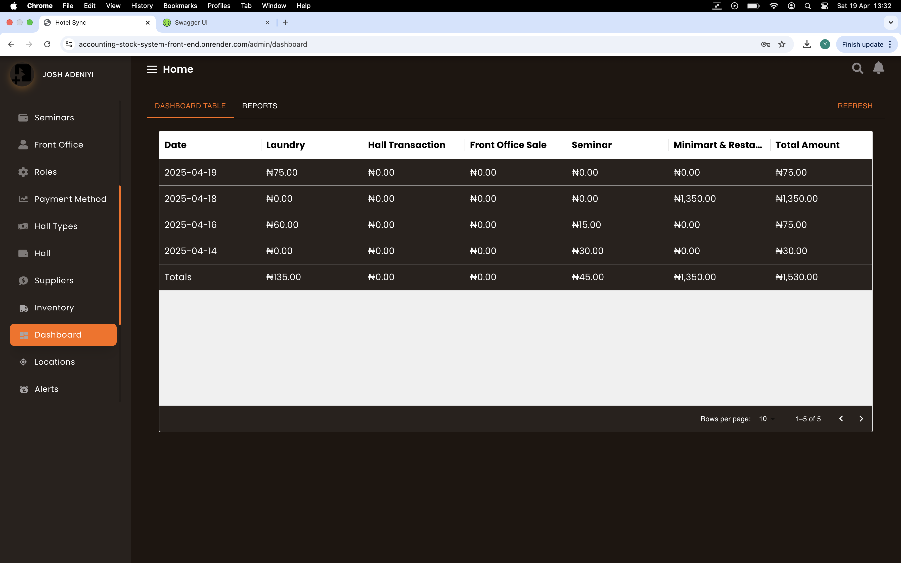

# HotelSync - Smart Business Management Software


HotelSync is a full-stack web application designed to streamline operations for hotels and small businesses. It tracks sales across departments (front office, restaurant, mini mart, kabsa, seminars, hall), manages inventory with AI-driven alerts, handles expenses,trade debtors and delivers real-time analytics via dynamic dashboards. Built with the MERN stack, it’s scalable, secure, and ready to empower businesses.

## 🚀 Demo
Watch a 3-minutes demo of HotelSync in action:

[](https://youtu.be/r2bR4q6f4Fg)

## ✨ Features
- **Multi-Department Sales Tracking**: Monitor transactions in real time across front office, restaurant, laundry, and more.
- **AI-Powered Inventory Management**: Cronjob alerts for low stock or perishable items, ensuring audit-ready accuracy.
- **Expense & Accounting**: Chart of accounts for expenses, petty cash, and invoicing.
- **User Management**: Role-based permissions to secure data (e.g., manager vs. stock keeper).
- **Dynamic Dashboards**: Real-time bar charts for daily sales and cross-department analytics.
- **Audit Logs & Notifications**: Track actions and receive push alerts for critical updates.

## 🛠️ Tech Stack
- **Frontend**: React.js for a responsive, dynamic UI
- **Backend**: Node.js/Express for robust APIs
- **Database**: MongoDB for flexible data storage
- **Tools**: Chart.js for analytics, cronjobs for automation

## 📸 Screenshots
| Dashboard | Inventory Alerts |
|-----------|------------------|
|  |  |

## 🚀 Getting Started
### Prerequisites
- Node.js v16+
- MongoDB Atlas account
- npm or yarn

### Installation
1. Clone the repo:
   ```bash
   git clone https://github.com/monycanbuy/Project.git
